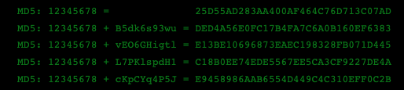

## NodeJS > Salt > Hashing

> Salt

O salt é utilizado no processo de hashing para forçar sua unicidade. O salt aumenta a complexidade do hash. Sem onerar ou dificultar a senha do usuário. E com isso se proteger de ataques como Rainbow tables.

> Hash

O Hash é uma função deterministica. Isso quer dizer que, dada uma certa entrada, ela produzirá sempre a mesma saída.

> Problema proposto

Supondo que um usuário tenha uma senha 12345678. O hash gerado será 25D55AD283AA400AF464C76D713C07AD (MD5).

Repare na tabela os usuários bruno e joão. Apesar de não saber o password é possivel identificar que eles possuem o mesmo hash. Como o hash é deterministico. É válido afirmar que ambos possuem a mesma senha.

> Como hashes são crackeados

Os métodos mais conhecidos atualmente para crackear um hash são:

- Dictionary attack
- Brute Force attack
- Lookup Table
- Reverse Lookup Table
- Rainbow Tables

O salt protege seu repositório de três deles. Lookup table, reverse lookup e rainbow table.

> Como o salt pode ajudar a evitar isso?

Lookup tables e Rainbow tables só funcionam porque cada senha é hasheada exatamente da mesma maneira.

Se dois usuários tiverem a mesma senha, eles terão os mesmos hashes. É possivel evitar isso adicionando um salt ao hash.

O salt é uma string aleatória. Que pode ser concatenado (préfixando ou pós-fixando) na senha.

Isso torna o hash de uma senha em uma string completamente diferente. Para verificar se uma senha está correta, é necessário o salt. Ela é normalmente armazenada no repositório no mesmo local do hash, ou junto dele.

O salt não precisa ser secreto. Só o fato de randomizar a Hash já é o suficiente para tornar as Lookup table e rainbow table ineficazes.

Um atacante não saberá com antecedência qual será o salt, portanto, não conseguirá pré-calcular uma Lookup table ou uma rainbow table.

O salt precisa ser aleatório, assim o ataque Reverse Lookup table também será ineficiente.

> Não crie seu próprio salt

Aqui vale a mesma regra para hash de senhas. Nunca crie salt. Existem bibliotecas já desenvolvida com esse próposito. Funções de hash são incrivelmente complexas, assim como as de salt.

Só crie seu salt em último caso.

> Salts ineficientes

Utilizar um único salt, tem o mesmo efeito que não utilizar nenhum. Na prática dois usuários com a mesma senha terá o mesmo hash. Perdendo totalmente seu objetivo.

Um salt deve ser grande, pois senão o atacante poderá montar Lookup tables ou Rainbow attack em cima do Salt.

Uma regra comumente utilizada é usar um salt com o mesmo tamanho da saída da função hash. Por exemplo, se utilizar o algoritimo SHA256, de 256 bits o salt deve ter 256bits aleatórios.

<!-- https://www.brunobrito.net.br/seguranca-salt-hash-senha/#:~:text=O%20salt%20%C3%A9%20utilizado%20no,de%20ataques%20como%20Rainbow%20tables. -->

---

